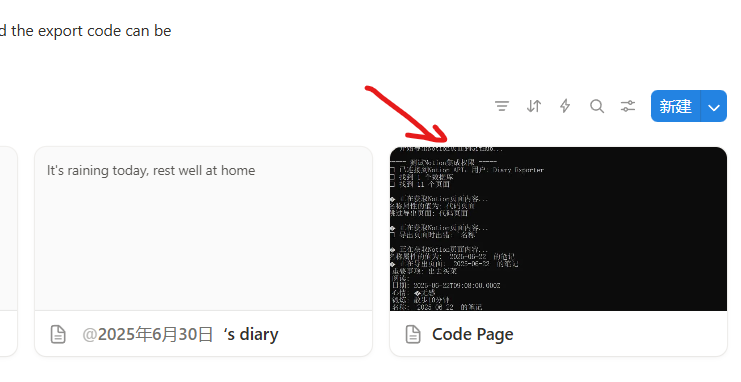
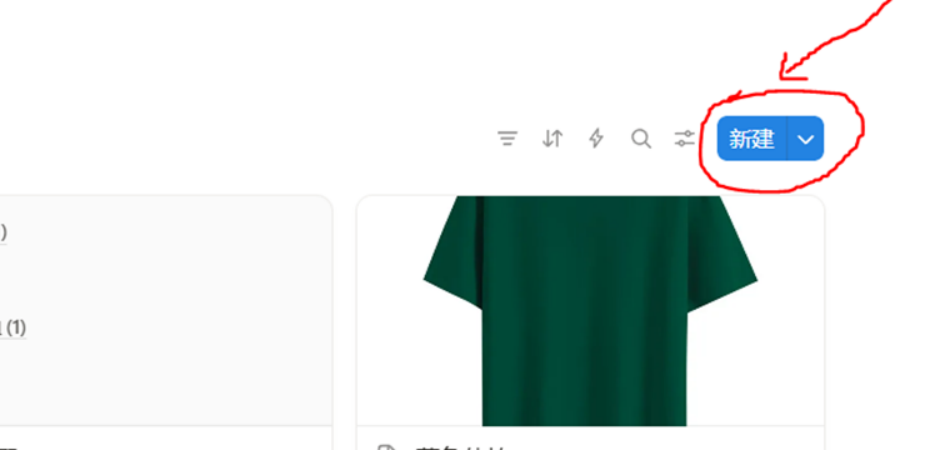
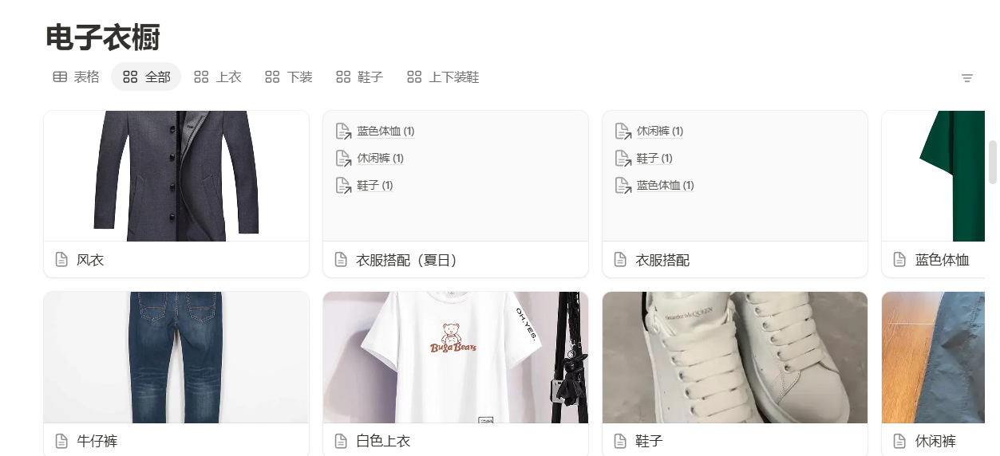

## 产品介绍
## 🚀 欢迎使用 Notion 工具集

我们的工具集专为 Notion 用户设计，提供了一系列强大的功能，帮助您更高效地组织信息、管理项目和自动化工作流程，目前完成的工具模板有2个，分别是notion日记的导出功能和电子衣橱模板，这两个模块都是建立在notion平台的基础上，即首先用户要是Notion用户，才能使用我们的工具集，下面分别做介绍。

一.notion日记的导出功能
Ｎｏｔｉｏｎ平台的官网是：https://www.notion.so/，本导出工具是建立在Notion平台日记的基础上，将日记和属性内容导出，目前Notion官方平台的导出要么只导出日记属性，要么只导出日记内容，无法同时导出属性和内容，因此，我们开发了此功能，将属性和内容都导出，
方便用户使用。本导出功能配备有日记模板，根据配备好的日记模板使用开发出的导出程序即可导出日记的属性和内容，需要注意的是本导出程序是根据python3.11开发的，因此需要自行安装python环境，用户可以自行到python官网(https://www.python.org/)下载安装,最好下载python3.11及以上版本，安装完成后，运行程序即可使用。
### ✨ 核心功能

1. **自带模板**：自带有notion日记模板，用户可以去notion模板市场购买和下载，模板上面的语言是英文，用户可以根据自己的需要自行翻译成想要的语言。

2. **数据同步**：安装好python环境后，运行本软件程序即可导出日记的属性和内容（内容不包含图片）。本软件程序在ｃｏｄｅｐａｇｅ页面中如下图：

3. **自动化**：创建自定义工作流程和自动化任务
4. **团队协作**：增强团队协作和项目管理功能

二．电子衣橱模板
本电子衣橱模板也是基于Ｎｏｔｉｏｎ平台的基础上开发出来的，本模板购买就即可使用，不需要附加另外的程序，操作简单便以使用，方面用户收藏自己买的的衣物，主要分为两部分都是简单容易操作的：新建衣物和搭配选择
新建衣物：
   当自己新买了衣物时需要录入到电子衣橱里，则点模板右上的“新建”按钮录入自己的新衣服，用户根据需要添加衣物的品牌，价格，分类（必须选择，否则后面的衣物搭配无法选择），收纳地点，尺寸，颜色等属性根据用户喜好填写，示例图如下：

  
  

### 📈 为什么选择我们？

- **简单易用**：无需编程知识，直观的界面设计
- **功能强大**：满足从个人用户到企业团队的各种需求
- **安全保障**：ｎｏｔｉｏｎ大平台，确保您的数据安全，隐私安全
- **持续更新**：新增功能和改进
